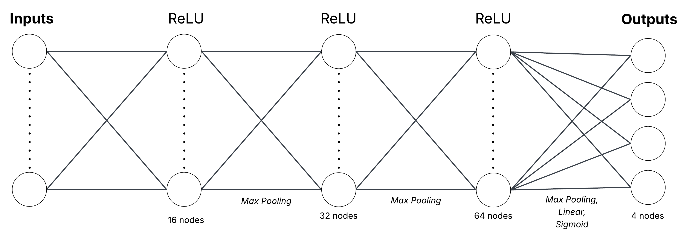

# CS4100 Final Project  
## AI-Assisted Playlist Ordering to Maximize Emotional Impact
Team Members: Khushi Khan, Dustin Zhang, Kayla Handley, Koena Gupta

## Code  
Notebooks and scripts:
1. [[`download_data.py`](https://github.com/khushikhan0/cs4100_project/blob/main/src/download_data.py)]: downloads the `fma_small.zip` file containing 8,000 tracks of 30s, 8 balanced genres (7.2GB) and `fma_metadata.zip` file containing metadata and features for all tracks. More information can be found from the [dataset source](https://github.com/mdeff/fma)
2. [[`fma_dataset_processed.ipynb`](https://github.com/khushikhan0/cs4100_project/blob/main/src/fma_dataset_processed.ipynb)]: loads the raw FMA metadata, filters to the 8,000 tracks with available MP3 files, and saves the cleaned dataset with track IDs, titles, genres, and file paths to data/cleaned/fma_cleaned_dataset.csv
3. [[`fma_emotion_labeling.ipynb`](https://github.com/khushikhan0/cs4100_project/blob/main/src/data_labeling/fma_emotion_labeling.ipynb)]: merges the cleaned FMA dataset with Echonest metadata to extract valence and energy values, computes four emotion scores per song (joy/excitement, peaceful/content, anger/tension, sadness) using Euclidean distance, applies softmax normalization, and saves 1,294 labeled tracks to data/cleaned/fma_emotion_labels.csv
4. [[`fma_spectrogram_generation.ipynb`](https://github.com/khushikhan0/cs4100_project/blob/main/src/fma_spectrogram_generation.ipynb)]: reads the emotion-labeled dataset and converts each MP3 file into a mel spectrogram, a 128 x 1,292 normalized image representing audio frequencies over time, and saves the spectrograms, labels, and track IDs as numpy arrays to `data/cleaned/`
5. [[`model.ipynb`](https://github.com/khushikhan0/cs4100_project/blob/main/src/model.ipynb)]: contains training and analysis of Convolutional Neural Network (CNN) model to predict emotional labels for songs based on spectrogram inputs.
6. [[`cnn.py`](https://github.com/khushikhan0/cs4100_project/blob/main/src/cnn.py)]: contains the CNN class.
7. [[`cnn_main.py`](https://github.com/khushikhan0/cs4100_project/blob/main/src/cnn_main.py)]: trains and saves the CNN model.
8. [[`CNN_state_dict.pth`](https://github.com/khushikhan0/cs4100_project/blob/main/src/CNN_state_dict.pth)]: contains saved post-training model weights for the CNN.
9. [[`main.py`](https://github.com/khushikhan0/cs4100_project/blob/main/src/main.py)]: runs the full pipeline. First takes any MP3 files found in src/input_mp3s and predicts emotion scores for them using the trained CNN. Then prompts the user to input where in their playlist they want certain emotions and prints out an appropriate ordering of the MP3 files.
10. [[`spectrogram_conversion.py`](https://github.com/khushikhan0/cs4100_project/blob/main/src/spectrogram_conversion.py)]: contains helper methods for converting MP3 files to spectrograms.
11. [[`spectrogram_dataset.py`](https://github.com/khushikhan0/cs4100_project/blob/main/src/spectrogramdataset.py)]: contains the SpectrogramDataset class.
12. [[`local_search/local_search.py`](https://github.com/khushikhan0/cs4100_project/blob/main/src/local_search/local_search.py)]: contains all logic for ordering the songs/MP3 files using local search.

## Usage: 
1. Clone and navigate to the repository.
```bash
git clone https://github.com/khushikhan0/cs4100_project.git
cd cs4100_project
```
2. Download the required packages.
```bash
pip install -r requirements.txt
```
4. Download the data.
```bash
download_data.py
```
3. Process the data.
...

## Model Architecture:

The CNN contains 3 convolutional layers with ReLU activation functions and max pooling applied to each layer. Linear and Sigmoid activation functions are applied to the output of 4 different emotions: joy-excitement, peaceful-content, anger-tension, and sadness.

## Data & Training:

## Results & Discussion:


